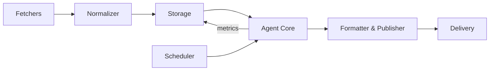

    

# it_news_cruncher

A compact, autonomous pipeline that generates daily IT "crunches" — short, structured digests summarizing the latest in software engineering, security, cloud, and AI. Designed to turn noisy, scattered IT news into concise, actionable summaries for engineers and tech leads.

## Why this project
- Reduce noise: distill high-volume feeds into bite-sized, actionable items.  
- Save time: deliver daily digests and support on-demand runs.  
- Automate curation: autonomous agent pipeline minimizes manual work.

## Architecture (high level)
- Fetchers: RSS, scrapers, and APIs.  
- Normalizer: unify article metadata and content.  
- Storage: dedupe, history, and metrics.  
- Agent core: classification, ranking (priority scoring), and summarization (LLM or local model).  
- Formatter & publisher: compose outputs in target formats.  
- Delivery: static site, API, email, Slack, etc.  
- Scheduler: daily runs and on-demand triggers.

